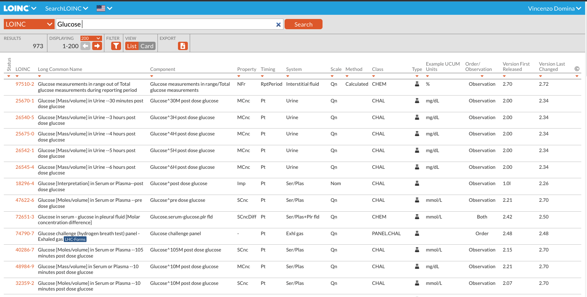

# Health Reference Online Browser
Web frontend application to browse all health data references and interact from online

Features:
- Open access
- List of all reference entries
- Search throughout all categories
- Filtering
- Sorting
- Export to CSV file

Compare it to the LOINC Reference database and their search portal: https://loinc.org/search/




## Architecture

This project was bootstrapped with

- [Create React App](https://github.com/facebook/create-react-app)
- [Material UI](https://material-ui.com/)

## Status

- [x] Alpha: We are testing with a closed set of contributers
- [ ] Public Alpha: Anyone can sign up over at [TBC](https://app.curedao.org).
- [ ] Public Beta: Stable enough for most non-enterprise use-cases
- [ ] Public: Production-ready

## Setup development environment (FRONTEND)

In the project directory navigate into frontend and start local environment with npm:

```shell
cd frontend
```

```shell
npm install
```

```shell
npm start
```

In the browser a new tab with [http://localhost:3000](http://localhost:3000) will be opened and the application loads.<br>
The page will automatically reload if you make changes to the code.<br>
You will see the build errors and lint warnings in the console. Example:

<p align='center'>

</p>

### `npm test` or `yarn test`

Runs the test watcher in an interactive mode.<br>
By default, runs tests related to files changed since the last commit.

[Read more about testing.](https://facebook.github.io/create-react-app/docs/running-tests)

### `npm run build` or `yarn build`

Builds the app for production to the `build` folder.<br>
It correctly bundles React in production mode and optimizes the build for the best performance.

The build is minified and the filenames include the hashes.<br>

Your app is ready to be deployed.

## User Guide

You can find detailed instructions on using Create React App and many tips in [its documentation](https://facebook.github.io/create-react-app/).
